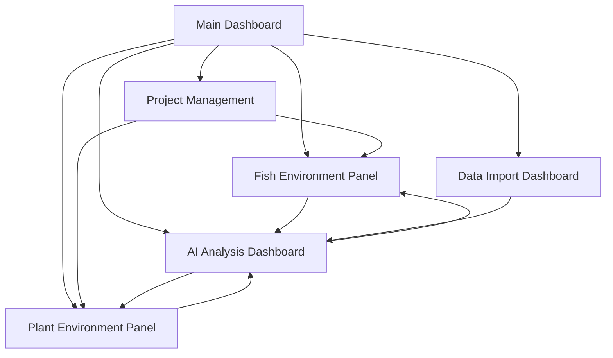

# AquaNexus - Comprehensive Aquaponics Monitoring System

## 1. Product Overview
AquaNexus is a robust IoT-driven aquaponics monitoring platform that provides users with real-time, AI-powered insights for optimizing multiple aquaponics environments using ESP32 devices and advanced data visualization.

The platform solves the challenge of manual aquaponics monitoring by automating data collection from fish and plant environments, delivering actionable AI recommendations, and enabling users to manage multiple projects efficiently through modern web dashboards.

Target market: Aquaponics enthusiasts, commercial growers, and research institutions seeking data-driven optimization of their aquaponics systems.

## 2. Core Features

### 2.1 User Roles
| Role | Registration Method | Core Permissions |
|------|---------------------|------------------|
| Default User | Email registration via Appwrite | Can create projects, monitor environments, view AI insights, import data |

### 2.2 Feature Module
Our AquaNexus platform consists of the following main pages:
1. **Main Dashboard**: Project overview cards, system status indicators, quick access navigation
2. **Fish Environment Panel**: Real-time TDS, pH, temperature readings with historical charts and alerts
3. **Plant Environment Panel**: Growth tracking, BME280 sensor data, environmental conditions monitoring
4. **AI Analysis Dashboard**: Actionable insights, predictions, health alerts, and optimization recommendations
5. **Data Import Dashboard**: CSV/JSON upload interface, data validation, batch processing controls
6. **Project Management**: Multi-project creation, ESP32 device assignment, fish/plant species selection

### 2.3 Page Details
| Page Name | Module Name | Feature description |
|-----------|-------------|---------------------|
| Main Dashboard | Project Overview | Display project cards with status, quick metrics, navigation to detailed views |
| Main Dashboard | System Status | Show overall system health, connected devices, recent alerts |
| Fish Environment Panel | Real-time Monitoring | Display live TDS, pH, temperature readings with color-coded status indicators |
| Fish Environment Panel | Historical Charts | Render time-series charts with year/month/week/day granularity for trend analysis |
| Fish Environment Panel | Alert System | Show threshold-based alerts with color coding and notification management |
| Plant Environment Panel | Growth Tracking | Monitor plant height progression using ultrasonic sensor data |
| Plant Environment Panel | Environmental Data | Display BME280 readings (temperature, humidity, pressure) with trend analysis |
| Plant Environment Panel | Health Monitoring | Track plant health indicators and growth patterns |
| AI Analysis Dashboard | Insights Generation | Provide system-wide optimization recommendations and maintenance suggestions |
| AI Analysis Dashboard | Predictive Analytics | Forecast harvest yields and identify potential issues before they occur |
| AI Analysis Dashboard | Health Alerts | Generate fish stress indicators and plant disease warnings |
| Data Import Dashboard | File Upload | Support CSV/JSON upload with drag-and-drop interface |
| Data Import Dashboard | Data Validation | Validate uploaded data format, show errors, provide correction suggestions |
| Data Import Dashboard | Batch Processing | Merge imported data with existing records, trigger AI analysis |
| Project Management | Project Creation | Create new aquaponics projects with custom configurations |
| Project Management | Device Assignment | Assign ESP32 devices to projects, manage device credentials |
| Project Management | Species Selection | Choose fish species (tilapia, catfish, trout, koi) and plant species (lettuce, basil, herbs) |

## 3. Core Process

**Main User Flow:**
Users start by creating a new aquaponics project and selecting fish/plant species. They then assign ESP32 devices to monitor fish and plant environments. The system continuously collects sensor data and displays real-time information on dedicated panels. AI analysis runs automatically to provide insights and alerts. Users can import historical data for comprehensive analysis and receive predictive recommendations for optimal system performance.

**Data Flow:**
ESP32 devices stream sensor data via WebSocket to the platform. Data is stored in MongoDB and processed by AI models. Real-time updates are pushed to the frontend dashboards. Users can trigger batch AI analysis after importing external datasets.

## 4. User Interface Design

### 4.1 Design Style
- **Primary Colors**: Aquatic blue (#0EA5E9) for fish-related data, vibrant green (#10B981) for plant-related data
- **Secondary Colors**: Neutral grays (#F8FAFC, #64748B) for backgrounds and text
- **Button Style**: Rounded corners with subtle shadows, hover animations
- **Font**: Inter font family with 14px base size, 16px for headings
- **Layout Style**: Card-based design with clean spacing, top navigation with sidebar for projects
- **Icons**: Lucide React icons for consistency, water droplet and leaf emojis for visual distinction

### 4.2 Page Design Overview
| Page Name | Module Name | UI Elements |
|-----------|-------------|-------------|
| Main Dashboard | Project Overview | Grid layout with project cards, status badges, gradient backgrounds |
| Main Dashboard | System Status | Horizontal status bar with icon indicators, real-time connection status |
| Fish Environment Panel | Real-time Monitoring | Large gauge components with blue color scheme, animated value updates |
| Fish Environment Panel | Historical Charts | Line charts with blue gradients, time range selectors, zoom functionality |
| Plant Environment Panel | Growth Tracking | Vertical progress bars, green color scheme, growth milestone markers |
| Plant Environment Panel | Environmental Data | Compact data cards with BME280 readings, trend arrows |
| AI Analysis Dashboard | Insights Generation | Expandable insight cards with action buttons, priority indicators |
| AI Analysis Dashboard | Predictive Analytics | Forecast charts with confidence intervals, timeline views |
| Data Import Dashboard | File Upload | Drag-and-drop zone with progress indicators, file preview |
| Data Import Dashboard | Data Validation | Error highlighting, validation status icons, correction suggestions |
| Project Management | Project Creation | Step-by-step wizard with form validation, species selection dropdowns |
| Project Management | Device Assignment | Device grid with connection status, QR code generation for ESP32 setup |

### 4.3 Responsiveness
The platform is desktop-first with mobile-adaptive design. Touch interactions are optimized for mobile devices with larger touch targets and swipe gestures for chart navigation. Responsive breakpoints ensure optimal viewing on tablets and smartphones.